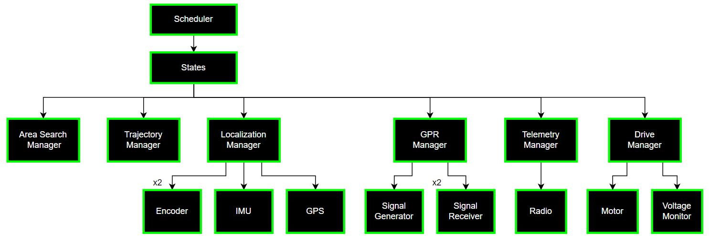
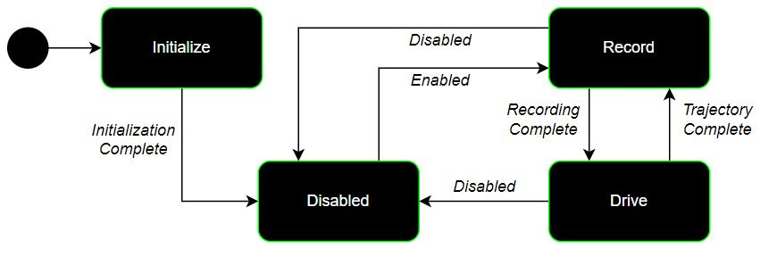

# Overview
This is the robot code for a college Capstone project aiming to put a ground-penetrating radar on a treaded robot. The robot's job is to respond to remote-controlled commands, figure out its location, send radar pulses and record the echoes, and telemeter that information back to a computer for further processing.

This software runs on an STM32F767 microcontroller. Expected attached hardware includes an RC remote receiver, radar receiver, radar signal generator and transmitter, 2 quadrature encoders, IMU, GPS, transmitting radio, 2 motor drivers and motors, and a status LED.

# Dev Environment Setup
1. Install STM32CubeIDE (https://www.st.com/en/development-tools/stm32cubeide.html)
2. Clone this repository into folder outside default STM32CubeIDE workspace
3. Open project in IDE with `File->Import->General->Existing Projects into Workspace`
4. Build code by clicking hammer in toolbar. The dropdown may show various build options
5. Debug or Launch code by clicking on bug or run button in toolbar. If gpr_bot_stm32 is not available, click on `Debug Configurations...` to find it.

# Custom Software

## Scheduler
- Entrypoint of custom software
- Controls initialization, running, and cleanup of current state
- Ensures code loops run at a fixed rate for best robot perception and control
- Contains primary state machine, finding next state based on current state and its "end status"

## States
- Each state has a specific set of tasks to run once at the beginning, every time through its loop, and once at its end
- State loops return an "end status" as an indicator to the scheduler of an important event

## UI Manager
- Gathers raw button values from RC Receiver driver
- Tracks button states from RC Receiver
- Converts button states into meaningful commands

## Localization Manager
- Gathers sensor data from encoders, GPS, and IMU if available
- Tracks estimated robot pose, velocity, and uncertainty in those measurements
- Updates estimated pose, velocity, and uncertainty with new sensor data using Kalman filtering

## GPR Manager
- Controls timing of signal generation, signal reception, and reference clock for signal receiving mixing
- Provides method for changing state-specific GPR parameters (pulse frequency, pulse width, and sample length)

## Telemetry Manager
- Holds definition for telemetered packet protocol, including location, GPR frequency, and recorded GPR data in the body
- Controls timing of radio to prevent oversending

## Drive Manager
- Scales user drive setpoints as needed to maintain physically attainable movement
- Adjusts motor setpoints based on drive setpoints and current pose/velocity
- Passes motor setpoints to motor controller driver

### LED Manager
- Holds all possible states of LED, each of which maps to a blink pattern
- Controls timing of LED blink patterns
- Sends direct on/off commands to LED driver when applicable

# File Organization

## Top Level
- .cproject: Holds all information relevant to builds and compiler options with those builds
- .project: IDE project setup info
- \*.ld: Linker script files for defining RAM/FLASH memory limits/location
- \*.launch: Configuration file for microcontroller programming/debug
- gpr_bot_stm32.ioc: Primary hardware configuration file. Opens as a GUI in STM32CubeIDE and should only be edited from there

## Core
- Code generated by STM32Cube to initialize peripherals and there pins/parameters
- Main entrypoint in main.c. Only custom code points to scheduler

## Drivers
- STM32 pre-written HAL drivers. Only driver files whose peripherals are used are imported.

## Hardware
- Custom drivers for communicating with external hardware
- Includes datasheets for specific hardware when device communication involves specific commands (ex. IMU, but not signal receiver)

## Libraries
- Third-party, open-source code. All licenses listed at top of files

## Media
- Media related to gpr_bot. Primarily used for embedding media in this README

## System
- All custom software that doesn't communicate directly with external hardware
- Consists of scheduler and all managers